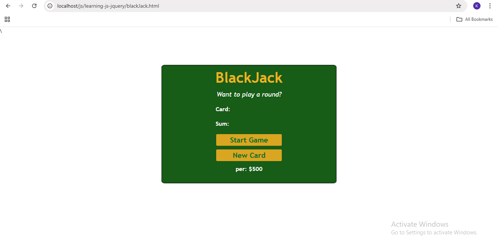
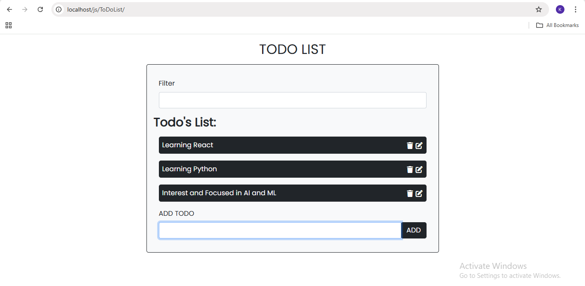

# JavaScript Practice Projects 🔧

This repository contains my JavaScript learning journey — a collection of small practice files, mini-projects, and exploratory code I wrote while learning JS, jQuery, ES6+, and DOM manipulation.

## 📦 Contents

- 📝 **Todo List App**
  - Add, update, delete, and search todos
  - Stores data in localStorage
  - Functional and usable

- 🎮 **Blackjack Game**
  - A simple browser card game using DOM manipulation
  - Core logic and interactivity built using JavaScript

- 🌦️ **Weather API App**
  - Fetches weather info using city input
  - Displays condition, temperature, and icon

- 🧪 **Other Practice Files**
  - Commented explanations and notes throughout
  - JS basics, ES6 features, DOM practice
  - Some files are intentionally raw or for testing concepts

## 🎯 Purpose

This is not a polished portfolio — it’s a **learning ground**.  
Each file or folder represents something I explored or tried to understand better.

## 📷 Preview

Some Others:
[Coin Flipper](CoinFlipper.png)
[Form Validation](FormValidation.png)